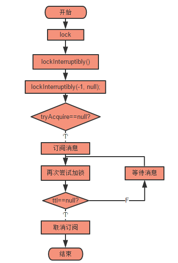

# distributed-lock

[](https://travis-ci.org/go-redsync/redsync)


Distributed locks are a very useful primitive in many environments where different processes must operate with shared resources in a mutually exclusive way. `distributed-lock` provides a Redis-based distributed mutual exclusion lock implementation for Go as described.


## Installation


Install Redsync using the go get command:

    $ go get github.com/go-redsync/redsync

The only dependencies are the Go distribution and [Redigo](https://github.com/gomodule/redigo).

## Documentation

- [Reference](https://godoc.org/github.com/go-redsync/redsync)

## Contributing

Contributions are welcome.

## License

Redsync is available under the [BSD (3-Clause) License](https://opensource.org/licenses/BSD-3-Clause).

## Disclaimer

This code implements an algorithm which is currently a proposal, it was not formally analyzed. Make sure to understand how it works before using it in production environments.


## 一、实现分布式锁的要求

1. 互斥性。在任何时候，当且仅有一个客户端能够持有锁。
2. 不能有死锁。持有锁的客户端崩溃后，后续客户端能够加锁。
3. 容错性。大部分Redis或者ZooKeeper节点能够正常运行。
4. 加锁解锁相同。加锁的客户端和解锁的客户端必须为同一个客户端，不能让其他的解锁了。

## 二、Redis实现分布式锁的常用命令

1.SETNX key val

当且仅当key不存在时，set一个key为val的字符串，返回1；若key存在，则什么都不做，返回0。

2.expire key timeout

为key设置一个超时时间，单位为second，超过这个时间锁会自动释放，避免死锁。

3.delete key

删除key，此处用来解锁使用。

4.HEXISTS key field

当key 中存储着field的时候返回1，如果key或者field至少有一个不存在返回0。

5.HINCRBY key field increment

将存储在 key 中的哈希（Hash）对象中的指定字段 field 的值加上增量 increment。如果键 key 不存在，一个保存了哈希对象的新建将被创建。如果字段 field 不存在，在进行当前操作前，其将被创建，且对应的值被置为 0。返回值是增量之后的值。

## 三、常见写法

由上面三个命令，我们可以很快的写一个分布式锁出来：

```
if (conn.setnx("lock","1").equals(1L)) { 
    //do something
    return true; 
} 
```

return false; 

但是这样也会存在问题，如果获取该锁的客户端挂掉了怎么办？一般而言，我们可以通过设置expire的过期时间来防止客户端挂掉所带来的影响，可以降低应用挂掉所带来的影响，不过当时间失效的时候，要保证其他客户端只有一台能够获取。

## 四、Redisson

Redisson在基于NIO的Netty框架上，充分的利用了Redis键值数据库提供的一系列优势，在Java实用工具包中常用接口的基础上，为使用者提供了一系列具有分布式特性的常用工具类。使得原本作为协调单机多线程并发程序的工具包获得了协调分布式多机多线程并发系统的能力，大大降低了设计和研发大规模分布式系统的难度。同时结合各富特色的分布式服务，更进一步简化了分布式环境中程序相互之间的协作。——摘自百度百科

### 4.1 测试例子
先在pom引入Redssion

```
<dependency>
    <groupId>org.redisson</groupId>
    <artifactId>redisson</artifactId>
    <version>3.6.1</version>
</dependency>
```

起100个线程，同时对count进行操作，每次操作减1，加锁的时候能够保持顺序输出，不加的话为随机。

```
public class RedissonTest implements Runnable {
    private static RedissonClient redisson;
    private static int count = 10000;

    private static void init() {
        Config config = new Config();
        config.useSingleServer()
                .setAddress("redis://119.23.46.71:6340")
                .setPassword("root")
                .setDatabase(10);
        redisson = Redisson.create(config);
    }

    @Override
    public void run() {
        RLock lock = redisson.getLock("anyLock");
        lock.lock();
        count--;
        System.out.println(count);
        lock.unlock();
    }

    public static void main(String[] args) {
        init();
        for (int i = 0; i < 100; i++) {
            new Thread(new RedissonTest()).start();
        }
    }
}
```
输出结果（部分结果）：

```
...
9930
9929
9928
9927
9926
9925
9924
9923
9922
9921

...
```

去掉lock.lock()和lock.unlock()之后（部分结果）：

```
...
9930
9931
9933
9935
9938
9937
9940
9941
9942
9944
9947
9946
9914
...
```

## 五、RedissonLock源码分析

最新版的Redisson要求redis能够支持eval的命令，否则无法实现，即Redis要求2.6版本以上。在lua脚本中可以调用大部分的Redis命令，使用脚本的好处如下：

(1)减少网络开销:在Redis操作需求需要向Redis发送5次请求，而使用脚本功能完成同样的操作只需要发送一个请求即可，减少了网络往返时延。

(2)原子操作:Redis会将整个脚本作为一个整体执行，中间不会被其他命令插入。换句话说在编写脚本的过程中无需担心会出现竞态条件，也就无需使用事务。事务可以完成的所有功能都可以用脚本来实现。

(3)复用:客户端发送的脚本会永久存储在Redis中，这就意味着其他客户端(可以是其他语言开发的项目)可以复用这一脚本而不需要使用代码完成同样的逻辑。


### 5.1 使用到的全局变量

全局变量：

expirationRenewalMap：存储entryName和其过期时间，底层用的netty的PlatformDependent.newConcurrentHashMap()
internalLockLeaseTime：锁默认释放的时间：30 * 1000，即30秒
id：UUID，用作客户端的唯一标识
PUBSUB：订阅者模式，当释放锁的时候，其他客户端能够知道锁已经被释放的消息，并让队列中的第一个消费者获取锁。使用PUB/SUB消息机制的优点：减少申请锁时的等待时间、安全、 锁带有超时时间、锁的标识唯一，防止死锁 锁设计为可重入，避免死锁。
commandExecutor：命令执行器，异步执行器

### 5.2 加锁

以lock.lock()为例，调用lock之后，底层使用的是lockInterruptibly，之后调用lockInterruptibly(-1, null);

（1）我们来看一下lockInterruptibly的源码，如果别的客户端没有加锁，则当前客户端进行加锁并且订阅，其他客户端尝试加锁，并且获取ttl，然后等待已经加了锁的客户端解锁。

```
//leaseTime默认为-1
public void lockInterruptibly(long leaseTime, TimeUnit unit) throws InterruptedException {
    long threadId = Thread.currentThread().getId();//获取当前线程ID
    Long ttl = tryAcquire(leaseTime, unit, threadId);//尝试加锁
    // 如果为空，当前线程获取锁成功，否则已经被其他客户端加锁
    if (ttl == null) {
        return;
    }
    //等待释放，并订阅锁
    RFuture<RedissonLockEntry> future = subscribe(threadId);
    commandExecutor.syncSubscription(future);
    try {
        while (true) {
            // 重新尝试获取锁
            ttl = tryAcquire(leaseTime, unit, threadId);
            // 成功获取锁
            if (ttl == null) {
                break;
            }
            // 等待锁释放
            if (ttl >= 0) {
                getEntry(threadId).getLatch().tryAcquire(ttl, TimeUnit.MILLISECONDS);
            } else {
                getEntry(threadId).getLatch().acquire();
            }
        }
    } finally {
        // 取消订阅
        unsubscribe(future, threadId);
    }
}
```
（2）下面是tryAcquire的实现，调用的是tryAcquireAsync

    private Long tryAcquire(long leaseTime, TimeUnit unit, long threadId) {
        return get(tryAcquireAsync(leaseTime, unit, threadId));
    }
（3）下面是tryAcquireAsync的实现，异步尝试进行加锁，尝试加锁的时候leaseTime为-1。通常如果客户端没有加锁成功，则会进行阻塞，leaseTime为锁释放的时间。

```
private <T> RFuture<Long> tryAcquireAsync(long leaseTime, TimeUnit unit, final long threadId) {
    if (leaseTime != -1) {   //在lock.lock()的时候，已经声明了leaseTime为-1，尝试加锁
        return tryLockInnerAsync(leaseTime, unit, threadId, RedisCommands.EVAL_LONG);
    }
    RFuture<Long> ttlRemainingFuture = tryLockInnerAsync(commandExecutor.getConnectionManager().getCfg().getLockWatchdogTimeout(), TimeUnit.MILLISECONDS, threadId, RedisCommands.EVAL_LONG);
    //监听事件，订阅消息
    ttlRemainingFuture.addListener(new FutureListener<Long>() {
        @Override
        public void operationComplete(Future<Long> future) throws Exception {
            if (!future.isSuccess()) {
                return;
            }
            Long ttlRemaining = future.getNow();
            // lock acquired
            if (ttlRemaining == null) {
                //获取新的超时时间
                scheduleExpirationRenewal(threadId);
            }
        }
    });
    return ttlRemainingFuture;  //返回ttl时间
}
```

（4）下面是tryLockInnerAsyncy异步加锁，使用lua能够保证操作是原子性的

```
<T> RFuture<T> tryLockInnerAsync(long leaseTime, TimeUnit unit, long threadId, RedisStrictCommand<T> command) {
    internalLockLeaseTime = unit.toMillis(leaseTime);
    return commandExecutor.evalWriteAsync(getName(), LongCodec.INSTANCE, command,
              "if (redis.call('exists', KEYS[1]) == 0) then " +
                  "redis.call('hset', KEYS[1], ARGV[2], 1); " +
                  "redis.call('pexpire', KEYS[1], ARGV[1]); " +
                  "return nil; " +
              "end; " +
              "if (redis.call('hexists', KEYS[1], ARGV[2]) == 1) then " +
                  "redis.call('hincrby', KEYS[1], ARGV[2], 1); " +
                  "redis.call('pexpire', KEYS[1], ARGV[1]); " +
                  "return nil; " +
              "end; " +
              "return redis.call('pttl', KEYS[1]);",
                Collections.<Object>singletonList(getName()), internalLockLeaseTime, getLockName(threadId));
}
```

参数
KEYS[1](getName()) ：需要加锁的key，这里需要是字符串类型。
ARGV[1](internalLockLeaseTime) ：锁的超时时间，防止死锁
ARGV[2](getLockName(threadId)) ：锁的唯一标识，也就是刚才介绍的 id（UUID.randomUUID()） + “:” + threadId

### lua脚本解释

--检查key是否被占用了，如果没有则设置超时时间和唯一标识，初始化value=1

```
if (redis.call('exists', KEYS[1]) == 0) then
  redis.call('hset', KEYS[1], ARGV[2], 1);
  redis.call('pexpire', KEYS[1], ARGV[1]);
  return nil; 
end; 
```
--如果锁重入,需要判断锁的key field 都一致情况下 value 加一 

```
if (redis.call('hexists', KEYS[1], ARGV[2]) == 1) then 
  redis.call('hincrby', KEYS[1], ARGV[2], 1);
  --锁重入重新设置超时时间  
  redis.call('pexpire', KEYS[1], ARGV[1]); 
  return nil; 
end;
```
--返回剩余的过期时间

```
return redis.call('pttl', KEYS[1]);
```
（5）流程图



### 5.3 解锁

解锁的代码很简单，大意是将该节点删除，并发布消息。

（1）unlock源码

    public void unlock() {
        Boolean opStatus = get(unlockInnerAsync(Thread.currentThread().getId()));
        if (opStatus == null) {
            throw new IllegalMonitorStateException("attempt to unlock lock, not locked by current thread by node id: "
                    + id + " thread-id: " + Thread.currentThread().getId());
        }
        if (opStatus) {
            cancelExpirationRenewal();
        }
（2）异步解锁，并返回是否成功
```
protected RFuture<Boolean> unlockInnerAsync(long threadId) {
    return commandExecutor.evalWriteAsync(getName(), LongCodec.INSTANCE, RedisCommands.EVAL_BOOLEAN,
            "if (redis.call('exists', KEYS[1]) == 0) then " +
                "redis.call('publish', KEYS[2], ARGV[1]); " +
                "return 1; " +
            "end;" +
            "if (redis.call('hexists', KEYS[1], ARGV[3]) == 0) then " +
                "return nil;" +
            "end; " +
            "local counter = redis.call('hincrby', KEYS[1], ARGV[3], -1); " +
            "if (counter > 0) then " +
                "redis.call('pexpire', KEYS[1], ARGV[2]); " +
                "return 0; " +
            "else " +
                "redis.call('del', KEYS[1]); " +
                "redis.call('publish', KEYS[2], ARGV[1]); " +
                "return 1; "+
            "end; " +
            "return nil;",
            Arrays.<Object>asList(getName(), getChannelName()), LockPubSub.unlockMessage, internalLockLeaseTime, getLockName(threadId));

    }
```

##### 输入的参数有：
参数：

KEYS[1](getName())：需要加锁的key，这里需要是字符串类型。

KEYS[2](getChannelName())：redis消息的ChannelName,一个分布式锁对应唯一的一个 channelName:“redisson_lock__channel__{” + getName() + “}”

ARGV[1](LockPubSub.unlockMessage)：redis消息体，这里只需要一个字节的标记就可以，主要标记redis的key已经解锁，再结合redis的Subscribe，能唤醒其他订阅解锁消息的客户端线程申请锁。

ARGV[2](internalLockLeaseTime)：锁的超时时间，防止死锁

ARGV[3](getLockName(threadId)) ：锁的唯一标识，也就是刚才介绍的 id（UUID.randomUUID()） + “:” + threadId

此处lua脚本的作用：

* 如果keys[1]不存在，则发布消息，说明已经被解锁了

```
if (redis.call('exists', KEYS[1]) == 0) then
    redis.call('publish', KEYS[2], ARGV[1]);
    return 1;
end;
```

* key和field不匹配，说明当前客户端线程没有持有锁，不能主动解锁。

```
if (redis.call('hexists', KEYS[1], ARGV[3]) == 0) then
    return nil;
end;
```

* 将value减1，这里主要用在重入锁

```
local counter = redis.call('hincrby', KEYS[1], ARGV[3], -1); 
if (counter > 0) then 
    redis.call('pexpire', KEYS[1], ARGV[2]); 
    return 0; 
else 
```

* 删除key并消息

```
    redis.call('del', KEYS[1]); 
    redis.call('publish', KEYS[2], ARGV[1]); 
    return 1;
end; 
return nil;   
```     

（3）删除过期信息

```
void cancelExpirationRenewal() {
    Timeout task = expirationRenewalMap.remove(getEntryName());
    if (task != null) {
        task.cancel();
    }
}
```

## 总结

Redis2.6版本之后引入了eval，能够支持lua脚本，更好的保证了redis的原子性，而且redisson采用了大量异步的写法来避免性能所带来的影响。本文只是讲解了下redisson的重入锁，其还有公平锁、联锁、红锁、读写锁等，有兴趣的可以看下。感觉这篇文章写得也不是很好，毕竟netty还没开始学，有些api也不太清楚，希望各位大佬能够建议建议~~


